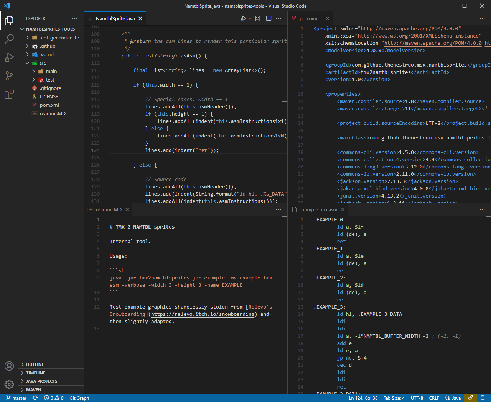
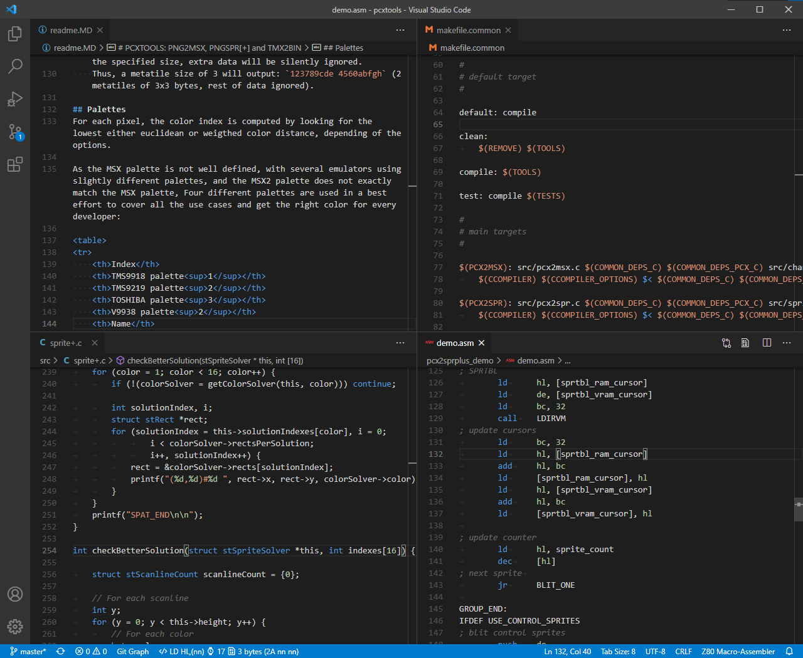
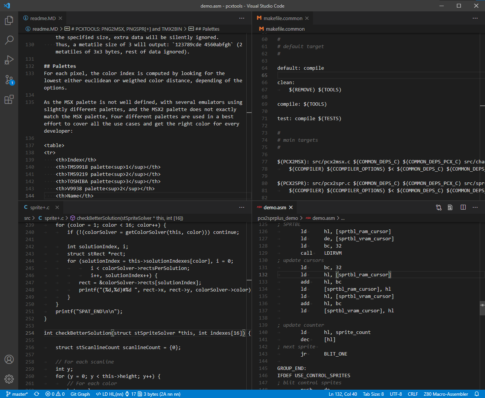

# Dark-

Simple dark themes, based on the default _Dark (Visual Studio)_ theme but with _less_ syntax highlight.

**Dark-** is actually comprised by four themes: the combination of two syntax themes, _Dark-_ and _Dark--_, with two workbench themes, _Default UI_ and _Flat UI_.

### Rationale

These themes keeps the familiar default look of side bar of the _Dark (Visual Studio)_ and _Dark+ (default dark)_.

On top of that, these themes dim the whitespace, the ruler and the line numbers to improve the contrast with the actual code.

The comments color is changed to gray from the default green.

### Syntax themes

The _Dark-_ syntax theme highlights comments, constants, keywords, and strings (basically: the minimum to easily spot mispelled keywords and non terminated strings).

The _Dark--_ syntax theme highlights just comments.

### Workbench themes

The _Default UI_ variations keep the familiar look of side bar of the _Dark (Visual Studio)_ and _Dark+ (default dark)_ themes.

The _Flat UI_ variations theme the workbench to a flatter (and hopefully cleaner) look.

## Screenshots

 _Theme: Dark- (flat UI)_

 _Theme: Dark- (default UI)_

 _Theme: Dark-- (default UI)_

## Credits

[**theNestruo**](https://github.com/theNestruo) ([Néstor Sancho](https://twitter.com/NestorSancho)).

