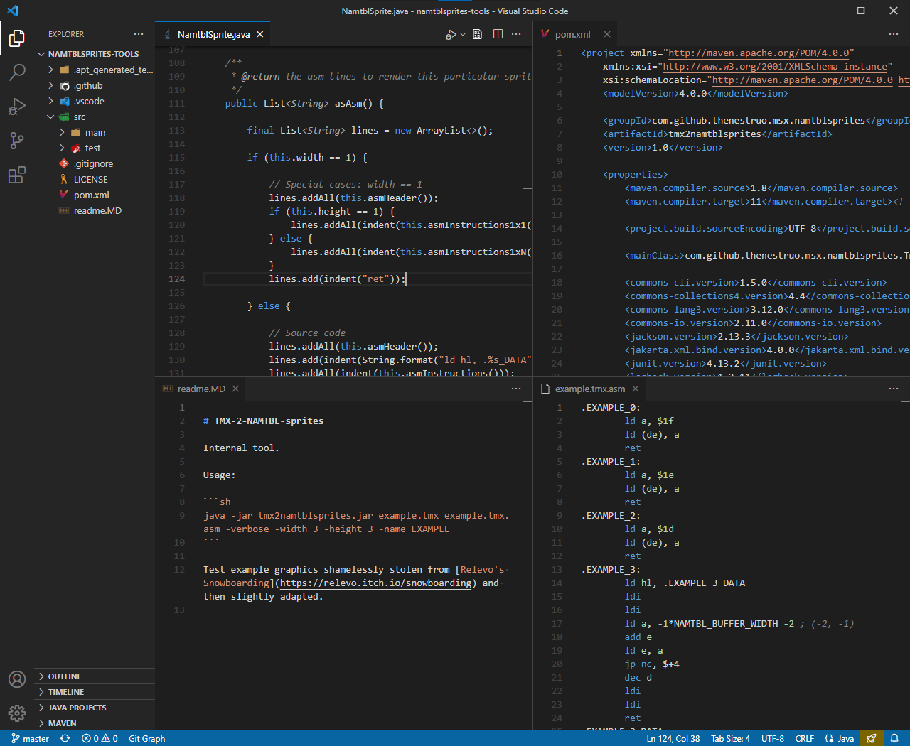

[](https://github.com/theNestruo/dark-minus-theme-vscode/actions)
[](https://marketplace.visualstudio.com/items?itemName=theNestruo.dark-minus-theme)

# Dark-

Simple dark themes, based on the default _Dark (Visual Studio)_ theme but with less syntax highlight.

**Dark-** are actually two themes: _Dark-_ and _Dark--_.

These themes keeps the familiar new look of side bar of the _Dark (Visual Studio)_ and _Dark+ (default dark)_.
On top of that, they both dim the whitespace, the ruler and the line numbers to improve the contrast with the actual code.
The comments color is changed to gray from the default green.

The _Dark-_ color theme highlights comments, constants, keywords, and strings (basically: the minimum to easily spot mispelled keywords and non terminated strings).

The _Dark--_ color theme highlights just comments.

## Screenshots


<br>_Theme: Dark-_


<br>_Theme: Dark--_

## Workbench color customizations

_Dark-_ and _Dark--_ themes are designed to be a generic replacement of the default _Dark (Visual Studio)_ theme. To be generic, they only diverge from the default theme in editor syntax colors; workbench color customizations are left out from the _Dark-_ and _Dark--_ themes, as they are subject to personal perferences.

Edit your settings JSON file to customize the user interface. The suggested workbench color customizations for _Dark-_ and _Dark--_ themes are:

```jsonc
"workbench.colorCustomizations": {
	"[Dark-][Dark--]": {
		// Flattens the UI:
		"titleBar.activeBackground": "#252526",
		"activityBar.background": "#252526",
		"tab.inactiveBackground": "#252526",
		"panel.background": "#252526",
		// Active/accent color:
		"tab.activeBorderTop": "#007acc",
		"editorWidget.border": "#007acc",
		"panelTitle.activeBorder": "#007acc",
		"tab.unfocusedActiveBorderTop": "#0000", // (disables accent color on unfocused tabs)
		// Dims the status bar:
		"statusBar.background": "#007accc0"
	},
}
```

Please note that these suggested workbench color customizations are also compatible with the _Dark (Visual Studio)_ and _Dark+ (default dark)_ default themes.

### Screenshot


<br>_Theme: Dark- with workbench color customizations_

## Credits

[**theNestruo**](https://github.com/theNestruo) ([Néstor Sancho](https://twitter.com/NestorSancho)).

