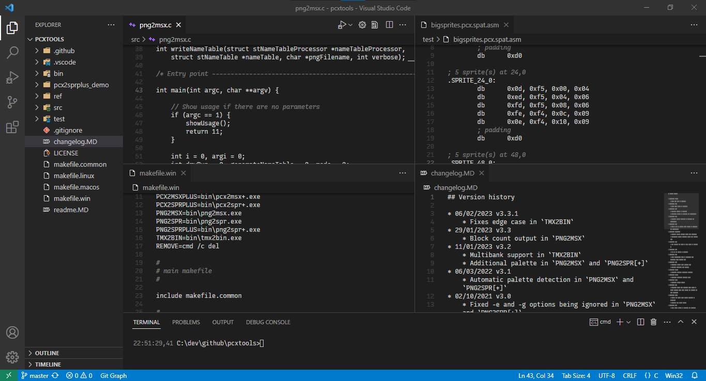

[](https://open-vsx.org/extension/theNestruo/dark-minus-theme)
[](https://marketplace.visualstudio.com/items?itemName=theNestruo.dark-minus-theme)


# Dark-

Simple dark themes, based on the default _Dark (Visual Studio)_ and _Dark Modern_ themes but with _less_ syntax highlight.

## Rationale

These themes keeps the familiar workbench look of the _Dark (Visual Studio)_, _Dark+_, and _Dark Modern_.

On top of that, these themes dim the whitespace, the ruler, and the line numbers to improve the contrast with the actual code.

The comments color is changed to gray from the default green.

## Themes

### Dark-

The _Dark-_ syntax theme highlights comments, constants, keywords, and strings (basically: the minimum to easily spot mispelled keywords and non terminated strings).

This syntax theme is available in four different workbench theme variations:

- **Dark- (Visual Studio)**, based on the _Dark (Visual Studio)_ theme.

- **Dark- Modern**, based on the _Dark Modern_ default theme.

- **Dark- (Visual Studio) (Flat UI)** and **Dark- Modern (Flat UI)** use a flatter (and hopefully cleaner) look, based on the _Dark (Visual Studio)_ and _Dark Modern_ workbench themes.

### Dark--

The _Dark--_ syntax theme highlights just comments.

This syntax theme is available in the **Dark-- (Visual Studio)** workbench theme variation only.

## Screenshots

.screenshot.png)
<br>_Theme: Dark- (Visual Studio) (Flat UI)_

.screenshot.png)
<br>_Theme: Dark- Modern (Flat UI))_


<br>_Theme: Dark-- (Visual Studio)_

## Customizations

Previous _Dark-_ versions featured some customizations over the workbench look of _Dark (Visual Studio)_ and _Dark+_ (such as a less bright status bar).

Those customizations have been removed from the theme for simplicity and consistency. Users can now tweak the themes according their particular taste.

### Suggestions

- Restore the "classic" status bar colors when using one of the _Dark- Modern_ variations:

	```json
	"workbench.colorCustomizations": {
		"statusBar.background": "#007acc",
		"statusBar.debuggingBackground": "#cc6633",
		"statusBar.foreground": "#ffffff",
		"statusBar.noFolderBackground": "#68217a",
		"statusBarItem.remoteBackground": "#16825d"
	}
	```

- The status bar color from the previous versions of the _Dark-_ theme was `#0e639c` (darker than the default `#007acc`):

	```json
	"workbench.colorCustomizations": {
		"statusBar.background": "#0e639c"
	}
	```

>	For a reference, the default status bar colors in _Dark (Visual Studio)_ and _Dark+_ are:
>
>	```json
>	"statusBar.background": "#007acc",
>	"statusBar.debuggingBackground": "#cc6633",
>	"statusBar.foreground": "#ffffff",
>	"statusBar.noFolderBackground": "#68217a",
>	"statusBarItem.remoteBackground": "#16825d"
>	```


## Credits

[**theNestruo**](https://github.com/theNestruo) (Néstor Sancho).

